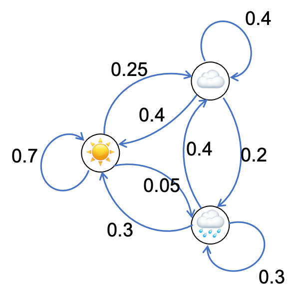
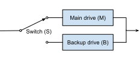
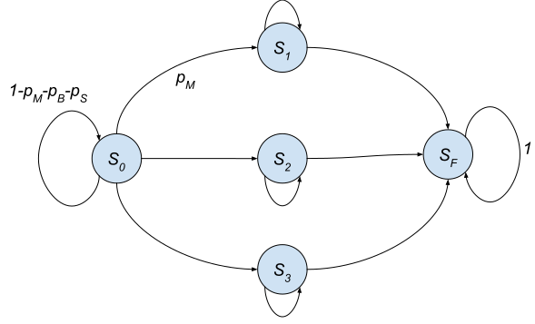

---
# Feel free to add content and custom Front Matter to this file.
# To modify the layout, see https://jekyllrb.com/docs/themes/#overriding-theme-defaults
layout: course-moi 
usemathjax: true
useJSXGraph: true
usePlotly: true
---

# Random sequences and Markov chains

In this section, we'll learn about random sequences, which provide a mathematical framework for studying the information content of digital signals, used later in the course. We'll discuss two models for random sequences: the iid model and Markov chains.

## Random sequences
As we discussed before, information is closely related to probability. As a result, to determine the information content of a signal, we need to describe it via a probabilistic model. As we have seen, a single value can be represented via a random variable. A digital signal in turn can be represented as a sequence of random variables, referred to as a _random sequence_. For example, consider a DNA sequence, the sequence of letters on this page, the maximum daily temperature in a given year, or the color of each pixel in an image. 

Note that randomness here doesn't mean that the signal/sequences is arbitrary. Obviously, not all sequences of letters form meaningful English sentences. Random characterization of signals means that we are uncertain about the value of the signal before observing it. For example, before reading an email you just received, you don't know the sequence of letters/words forming it. But certain words have higher probabilities than others to be the first word, e.g., "Hi, Hey, [Your name], Dear, I, ...". Then conditioned on the first word, you can assign probabilities to the second word. For example, if the first word is "Dear" the second word is likely to be your first name, "Ms.", "Mr.", etc. In the same way, you can assign probabilities to each word conditioned on all previous words. This will give you a complete probabilistic characterization of an email. 

It is extremely difficult, if not impossible, to construct precise models for most real-world signals. For example, a probabilistic model for an email addressed to you would take into account grammar, style, and many other factors, and would hence be exceedingly complex. But we can construct models with enough accuracy for many applications, including data compression. 

## The iid model
The simplest model for a random sequence is obtained by assuming each symbol in the sequence is <strong>i</strong>ndependent of the others and all symbols have an <strong>i</strong>dentical <strong>d</strong>istribution. As an example, consider the sequence

$$X_1,X_2,X_3,\dotsc,X_N$$

where each $X_i$ is the result of a roll of a fair die. For example, if $N=10$ one possible realization may be

$$6,4,1,6,6,5,5,5,3,4$$

 As another example of such a random sequence, consider a DNA sequence in which A and G have probability 1/3 each, and C and T have probability 1/6 each:

 AGACGGTAAGAATAGCAA

You may be thinking "Isn't this just the result of repeated trials?" and you'd be right. An iid sequence is just the result of repeated independent trials. We're just giving it a fancy  name to make life easier (or harder?) and help distinguish it from more complex models.

Other examples of iid sequences include a sequence of independent coin flips and colors of pixels in an image. The iid model is almost always a simplification. For example, pixels in an image are not independent since two adjacent pixels are likely to have the same or similar colors. 

Let us now build two simple iid models for English text. For simplicity, let us assume that English "alphabet" only has capital letters and space. The simplest model that we can construct is choosing symbols from this alphabet with equal probability. Such a process would lead to sequences such as

XFOML RXKHRJFFJUJ ZLPWCFWKCYJ FFJEYVKCQSGXYD QPAAMKBZAACIBZLHJQD.

which doesn't really look much like English text. 

We can improve this model by choosing each letter with a probability that is similar to its frequency in English. Such a model may produce

OCRO HLI RGWR NMIELWIS EU LL NBNESEBYA TH EEI ALHENHTTPA OOBTTVA NAH BRL.

which is slightly better. Neither model can produce text that looks like real English. However, the second model is still beneficial for data compression and leads to 15% better performance compared to not using a probabilistic model. (The first model if used for data compression would have the same performance as using no probabilistic model at all.)

#### The expected number of occurrence of a symbol in an iid sequence
Let $X_1,X_2,X_3,\dotsc,X_N$ be as iid random sequence, where each $X_i$ is the result of an independent roll of a die. How many times do you expect to see 3 if $N$ is large? Because this sequences is the result of repeated trials, we already know that for large $N$, 3 will be observed around $N/6$ times. More generally, if $i$ has probability $p_i$, then the number of times that we see $i$ in a random iid sequence of length $N$ is approximately $Np_i$. This simple fact will be useful to us later. 

  Find a coin and produce a sequence of 20 coin flips. Write down the resulting sequence. How many times did you observe heads?

 

## Markov chains
While the independent model is sufficient in some applications, usually the dependence between the elements of the sequence needs to be taken into account. One of the most common models for doing so are Markov chains.

Consider the following game: You start the game with &#x24;0.  A coin is flipped in each turn. If heads shows, you win &#x24;1 and if tails shows, you lose &#x24;1. Let $S_t$ denote your total winnings after round $t$. Play a few rounds of this very exciting game below.

<button onclick="playGame()">Play Game!</button>&nbsp;$S_0=0$

  Play the game until at least $S_{10}$. What are the values of $S_8$, $S_9, S_{10}$?

 

We are interested in the probabilistic properties this sequence, starting with its independence properties. Let's consider as an example $S_8$ and $S_{10}$. Clearly, they are not independent as each provides information about likely values for the other one. 

But now assume we know $S_9$. In this case, can $S_8$ provide any further information about $S_{10}$? The answer is no. All the information that $S_8$ contains about $S_{10}$ is already given by $S_9$. We thus say that $S_8$ and $S_{10}$ are conditionally independent given $S_9$. Mathematically, this means that

$$P(S_8=i,S_{10}=j|S_9=k)=P(S_8=i|S_9=k)P(S_{10}=j|S_9=k)$$

 More generally, for this process if the present is known, then the past does not provide any additional information about the future and vice versa. In other words, given the present, past and future are independent. 

 

A <strong>Markov chain</strong> (MC) is a random sequence that satisfies the <strong>Markov property</strong>, which states that given the present, the past and future are independent.
 

Markov chains can be used to describe a wide range of real-world processes, including DNA evolution and English text. However, precise descriptions may be too complex to be useful and we must rely on approximate representations, as we will discuss below.

In a Markov chain, the distribution of the future values depend on the present. So to describe it, we need to provide the distribution of each new value given the previous one. In our example,

$$P(S_{t+1}=i\vert S_{t}=j) = \begin{cases}1/2 & i=j+1\\1/2 & i=j-1\\0 & \text{else}\end{cases}$$

The value that the Markov chain takes at a specific point in time is called its _state_. The Markov chain arising from the game above can take values from a countably infinite set, namely the set of integers. We will focus on a simpler type of Markov chains which can take values only from a finite set, called *finite-state Markov chains*. As an example consider, a sequence $X_t$ that describes the weather, with the set of possible states being {🌞, ☁️, 🌧️}. To complete the description of this Markov chain, we need the probability of the chain going from one state in one day to another:

\begin{align*}
P(X_{t+1} = 🌞|X_{t}=🌞) &= .7 &P(X_{t+1} = ☁️|X_{t}=🌞) &= .25 &P(X_{t+1} = 🌧️|X_{t}=🌞) &= .05\\
P(X_{t+1} = 🌞|X_{t}=☁️) &= .4 &P(X_{t+1} = ☁️|X_{t}=☁️) &= .4 &P(X_{t+1} = 🌧️|X_{t}= ☁️) &= .2\\
P(X_{t+1} = 🌞|X_{t}=🌧️) &= .3 &P(X_{t+1} = ☁️|X_{t}=🌧️) &= .4 &P(X_{t+1} = 🌧️|X_{t}=🌧️) &= .3 
\end{align*}

For example, the second expression on the first line tells us that assuming that today is sunny, tomorrow will be cloudy with probability 25%. Note that this model is a simplification; for example, it does not consider seasons.

We can represent the conditional probabilities given above in the form of a table, where each row of the table is the conditional probability of the next state assuming that we are currently in a given state. These are called _transition probabilities_. we can also show them as a graph, with arrows representing possible transitions along with their probabilities.

<table width="1000px" text-align="center">
  <td width="40%">
     <table class="tabDefault" align="center">
  <thead>
    <tr>
      <th style="text-align: right">&nbsp;</th>
      <th>🌞</th>
      <th>☁️</th>
      <th>🌧️</th>
    </tr>
  </thead>
  <tbody>
    <tr>
      <th style="text-align: right">🌞</th>
      <td>.7</td>
      <td>.25</td>
      <td>.05</td>
    </tr>
    <tr>
      <th style="text-align: right">☁️</th>
      <td>.4</td>
      <td>.4</td>
      <td>.2</td>
    </tr>
    <tr>
      <th style="text-align: right">🌧️</th>
      <td>.3</td>
      <td>.4</td>
      <td>.3</td>
    </tr>
  </tbody>
</table>
  </td>
  <td width="40%"></td>
</table>
<!--

<svg width="200" height="200">
    <defs>
    <marker id="arrowhead" markerWidth="10" markerHeight="7" 
    refX="0" refY="3.5" orient="auto">
      <polygon points="0 0, 10 3.5, 0 7" />
    </marker>
  </defs>
<line x1="20" y1="100" x2="100" y2="150" stroke="#000" stroke-width="1" marker-end="url(#arrowhead)" />
<circle cx="20" cy="100" r="15" style="fill:white;stroke:black"/>
<text x='20' y='103' text-anchor='middle' alignment-baseline='middle'>🌞</text>
<circle cx="120" cy="155" r="15" style="fill:white;stroke:black"/>
<text x='120' y='158' text-anchor='middle' alignment-baseline='middle'>🌧️</text>
<circle cx="120" cy="45" r="15" style="fill:white;stroke:black"/>
<text x='120' y='48' text-anchor='middle' alignment-baseline='middle'>☁️</text>
</svg> 
-->

Click on the button to simulate a random sequences based on these probabilities that starts in the state 🌞.
 
<button onclick="generateWeather()"> Generate weather!</button>&nbsp;
  

Alternatively, and more commonly, we index the set of states using numbers $1,2,\dotsc$, e.g., 1=🌞, 2=☁️, 3=🌧️. Then we can represent the transition probabilities using a matrix called the _transition matrix_. The element in the i-th row and the j-th column is the probability of going to state $j$ given that we are in state $i$, i.e., 

$$A_{ij} = P(X_{t+1}=j\vert X_{t}=i).$$

\begin{equation*}
A = \left(\begin{array}{ccc}
.7 & .25 & .05\\
.4 & .4 & .2\\
.3 & .4 & .3
\end{array}\right)
\end{equation*}

Note that again each row of the matrix is the conditional distribution of the next state given that we are currently in a given state. For example, the first row of the matrix above tells us 'given that today is sunny, tomorrow is sunny with probability 70%, cloudy with probability 25%, and rainy with probability 5%. _So the values in each row must add up to 1._

  <button  onclick="showSolution(this,'wmc1')" style="float:right;">Show Solution</button>
  The simulated data above was generated based on 
  $$P(X_{t+1} = 🌞\vert X_{t}=🌞)=.75$$
  $$P(X_{t+1} = 🌧️\vert X_{t}=☁️)=.2$$
  In your simulated sequence of weather, what fraction of sunny days were followed by sunny days? What fraction of cloudy days were followed by rainy days? 
  

    In my case, there were 32 sunny days, among which 20 were followed by sunny days. So the fraction is 63% which is close to 70%, given that the size of the sample is small. Out of the 18 cloudy days only 1 was followed by a rainy day, so a fraction of 6%. The theoretical value is 20%. Such a large gap is not very likely but still can happen.
  

 

Below, you can set your own transition probabilities and then generate data that follows those probabilities: (If values in each row don't add up to 1, they will be normalized by the simulator.)

<table class="tabDefault" align="center">
  <thead>
    <tr>
      <th style="text-align: center">&emsp;&emsp;</th>
      <th>🌞</th>
      <th>☁️</th>
      <th>🌧️</th>
    </tr>
  </thead>
  <tbody>
    <tr>
      <th style="text-align: center">🌞</th>
      <td> <input type="number" id="A00" name="A00" min="0" max="1" step=".05" value="0.70"></td>
      <td> <input type="number" id="A01" name="A01" min="0" max="1" step=".05" value="0.25"></td>
      <td> <input type="number" id="A02" name="A02" min="0" max="1" step=".05" value="0.05"></td>
    </tr>
    <tr>
      <th style="text-align: center">☁️</th>
      <td> <input type="number" id="A10" name="A10" min="0" max="1" step=".05" value="0.40"></td>
      <td> <input type="number" id="A11" name="A11" min="0" max="1" step=".05" value="0.40"></td>
      <td> <input type="number" id="A12" name="A12" min="0" max="1" step=".05" value="0.20"></td>
    </tr>
    <tr>
      <th style="text-align: center">🌧️</th>
      <td> <input type="number" id="A20" name="A20" min="0" max="1" step=".05" value="0.30"></td>
      <td> <input type="number" id="A21" name="A21" min="0" max="1" step=".05" value="0.40"></td>
      <td> <input type="number" id="A22" name="A22" min="0" max="1" step=".05" value="0.30"></td>
    </tr>
  </tbody>
</table>

<button onclick="generateWeather2()"> Generate weather!</button>&nbsp;

  <button  onclick="showSolution(this,'designMC')" style="float:right;">Show Solution</button>
  For each item below, design a transition matrix such that the resulting Markov chain satisfies the given condition. If there are more than one such matrices, one solution is sufficient. Then generate sample data based on the transition matrix and verify that the condition is satisfied.
  <ol>
    <li>No two consecutive days have the same weather.</li>
    <li>The day following a sunny day is always cloudy, the day following a cloudy day is always rainy, and the day following a rainy day is always sunny.</li>
    <li>The day following a rainy day is always rainy.</li>
    <li>All days have an equal probability of being sunny, cloudy, or rainy.</li>
  </ol>
  

 We only solve the first case, leaving the others as exercise. We need to set the diagonal of the matrix to 0, for example,
      \begin{equation*}
A=\left(\begin{array}{ccc}
0 & .8 & .2\\
.5 & 0 & .5\\
.2 & .8 & 0
\end{array}\right).\end{equation*}
The sample data generated was 🌞☁️🌧️☁️🌧️☁️🌞☁️🌞☁️🌞☁️🌧️☁️🌞☁️🌧️☁️🌞☁️🌞☁️🌧️☁️🌧️☁️🌧️☁️🌧️🌞☁️🌞☁️🌞☁️🌞☁️🌧️☁️🌞☁️🌧️☁️🌞🌧️🌞☁️🌧️☁️🌞🌧️. Indeed no two consecutive days have the same weather.
  

 

  <button  onclick="showSolution(this,'dataCenterMC')" style="float:right;">Show Solution</button>
  An engineer is responsible for maintaining three servers. On any given day, each working server may fail with probability $p$, independent of others. An inoperative server will stay so until the engineer fixes it. But the engineer also has other assignments and is present on a given day with probability 1/2. When she is, she will fix all inoperative servers including those that have failed before that day and those that fail during that day. Let $X_t$ be the number of working servers on day $t$, which is a Markov chain. Note that for any day $t$ in which the engineer is present, $X_t=3$. Find the following transition probabilities:
  <ul>
    <li>$P\left(X_{t}=3|X_{t-1}=3\right)$</li>
    <li>$P\left(X_{t}=3|X_{t-1}=0\right)$</li>
    <li>$P\left(X_{t}=1|X_{t-1}=2\right)$</li>
    <li>$P\left(X_{t}=1|X_{t-1}=1\right)$</li>
  </ul>
  

  
Let us first find $P(X_t=3|X_{t-1}=3)$. On day $t$, the engineer is present with probability 1/2 and if she is, then $X_t=3$. Alternatively, the engineer is not present with probability 1/2. In this case, all three servers stay operational with probability $(1-p)^3$. So using the law of total probability:
    $$P(X_t=3|X_{t-1}=3) = \frac12 + \frac 12 (1-p)^3.$$

  
If $X_{t-1}=0$, then on day $t-1$ nothing's working. On day $t$, the engineer either fixes everything or everything stays inoperative. So 
    $$P\left(X_{t}=3|X_{t-1}=0\right)=\frac{1}{2},\qquad P\left(X_{t}=0|X_{t-1}=0\right)=\frac{1}{2}$$
    and all other values of $X_t$ have probability 0 in this case.

  
If $X_{t-1}=2$, then $X_t = 1$ occurs if the engineer is not present (with probability 1/2) and exactly one of the two working servers fails, which occurs with probability $2p(1-p)$. So
    $$P\left(X_{t}=1|X_{t-1}=2\right)=\frac12\cdot 2p(1-p) = p(1-p).$$
    The last case is left as an exercise.

  

 

<!--

  
The block diagram below represents a storage system with a main drive (M), a backup drive (B), and a switch (S). Each day, these components may fail with probabilities $p_M$, $p_B$, and $p_S$. If the main drive fails, the backup drive can be used. But the backup is in <em>cold standby</em> mode, meaning that it must be brought into operation externally when needed. This is the responsibility of the switch (S). (Switch pointing to B represents B being turned on and used as the storage drive.) This means that if the switch fails before the backup drive is needed, then it will not be able to turn it on. But after turning on B, the switch is not important any more.

 

We would like to construct a Markov chain that describes the behavior of this system. Such an MC can help us for example to determine the number of expected days until the system fails (we will not discuss this and only focus on constructing the MC).

We first need to determine the states of the MC. This is an example of a problem that if done wrong can be difficult to solve. Note that each component may be operational or inoperative. Furthermore, the switch has two states. So in total the system may have 16 different states, leading to a complicated Markov chain. But we can actually construct a simpler MC if we consider which states actually matter as the system changes. 

The system starts in the state in which all components being operations and the switch pointing to M (let's call this $S_0$). Then if M fails, the switch will turn B on (State $S_1$). Alternatively, S may fail ($S_2$) or B may fail ($S_3$). The system is operational in the states $S_0,S_1,S_2,S_3$. If we are in $S_1$, the B may fail and the system becomes inoperative ($S_F$). If we are in state $S_2$, then M may fail, again making the system inoperative (so again we will be in state $S_F$). If we are in state $S_3$, then M may fail, leading to $S_F$. So the states of our MC are

<ul>
  <li>$S_0$: All components working and S points to M.</li>
  <li>$S_1$: M fails and S points to B (backup is being used).</li>
  <li>$S_2$: M is operational but S fails.</li>
  <li>$S_3$: M is operational but B fails.</li>
  <li>$S_F$: The system has failed.</li>
</ul>

Given the five states above, the MC for this system is given below. Determine the missing probabilities.

  

 

-->
Markov chains are used extensively to analyze the reliability of systems. If you like to learn more about their use in this context as well as other techniques for the  design and evaluation of dependable computing systems, you are encouraged to take [ECE/CS 4434](https://homa-alem.github.io/teaching/ece_6434/){:target="_blank"}.

## Markov chains for modeling signals
Now let us use Markov chains to improve our models of the English language. This problem was considered by Shannon as an illustrative example in his <a href="http://people.math.harvard.edu/~ctm/home/text/others/shannon/entropy/entropy.pdf" target="_blank"> 1947 paper</a>, where he constructed models based on the book "Jefferson the Virginian". The examples below are from this paper. 

Since we are considering different models, we should discuss how we determine one is better than the other: The perfect model would produce simulated text that is indistinguishable from actual English. So we can judge our models by how similar to English they are.

First let us recall samples from the iid model with equal probabilities for each symbol:

XFOML RXKHRJFFJUJ ZLPWCFWKCYJ FFJEYVKCQSGXYD QPAAMKBZAACIBZLHJQD.

and iid with the probability of each symbol equal to its probability in English text:

OCRO HLI RGWR NMIELWIS EU LL NBNESEBYA TH EEI ALHENHTTPA OOBTTVA NAH BRL.

While the second model can be useful from an information-theoretic point of view, a Markov model will be a significant improvement as it can represent relationships between the symbols. Hence, we next construct a Markov model to better represent the fact that certain pairs of letters are more common. For example, if the current letter is Q, then the next one is likely to be U. So in this case, given the current letter, we use a conditional probability to produce the next letter.  You can see  these conditional probabilities (transition probabilities) in the graph below. Each row is the conditional probability of the next letter given the current letter. (If a letter is to small to see, you can zoom in.)

 

Data courtesy of <a href="http://www.ece.virginia.edu/~nds5j/" target="_blank"> Prof. Nikolaos Sidiropoulos</a>

<!--  -->
 

The lowest row corresponds to space. We can see for example that 't' is the most common letter after a space, showing that in English words begin with 't' most of the time (because words such as THE, THIS, THAT, ... are very common). We can also observe that as expected, q is almost always followed by u, space is likely after d and y (many adjectives, adverbs, and verbs end with one of these two letters). This model may for example produce

ON IE ANTSOUTINYS ARE T INCTORE ST BE S DEAMY ACHIN D ILONASIVE TUCOOWE AT TEASONARE FUSO TIZIN ANDY TOBE SEACE CTISBE.

Of course, in English each letter depends on more than just the previous letter. We can draw each letter by considering the two previous letters. This is called a _second order Markov chain_:

IN NO IST LAT WHEY CRATICT FROURE BIRS GROCID PONDENOME OF DEMONSTURES OF THE REPTAGIN IS REGOACTIONA OF CRE.

Although we are seeing increasing improvements in our model, it is better to switch to words rather than building higher-order models using individual letters. So in the next model, we choose words independently from each other but with probabilities that match their frequency in English:

REPRESENTING AND SPEEDILY IS AN GOOD APT OR COME CAN DIFFERENT NATURAL HERE HE THE A IN CAME THE TO OF TO EXPERT GRAY COME TO FURNISHES THE LINE MESSAGE HAD BE THESE.

Note that while each word is something that you can see in real English with high probability, there are pair of words that would not normally appear together: "AN GOOD", "THE A", "A IN".

Finally, let us construct a Markov model for words, where the probability distribution of each word is determined based on what the previous word is:

THE HEAD AND IN FRONTAL ATTACK ON AN ENGLISH WRITER THAT THE CHARACTER OF THIS POINT IS THEREFORE ANOTHER METHOD FOR THE LETTERS THAT THE TIME OF WHO EVER TOLD THE PROBLEM FOR AN UNEXPECTED.

This actually looks pretty good. Note, in particular, that each pair of words is something that you could see in real English, such as "THE LETTER", "ENGLISH WRITER".

So we have seen that Markov models can be used to model signals such as English text. They are also used extensively for modeling speech. In our context such models allow us to study the information content of these signals and determine how well they can be compressed. But the applications go far beyond that including speech recognition and predictive text.

### Experiment using other sources
To construct a model, we need to determine the probabilities of different outcomes. This is usually done using data. For example, the probability of each letter may be estimated by taking a large English document or a collection of documents and counting how many times each letter appears. (Determining probabilities based on data is the subject of _estimation theory_, an important topic with a wide range of applications including data science, machine learning, communications, and data-driven decision-making.) In the above examples English probabilities are estimated based on _Jefferson the Virginian_ by Dumas Malone. Below, you can use other sources or upload your own text using the "Choose File" button. Once the source is selected, the model will be built automatically and you can use it to regenerate text using the buttons below using different models. 

<select id="txtSelect">
    <option value="1">Ulysses</option>
    <option value="2">A Midsummer Night's Dream</option>
    <option value="3">Sherlock Holmes</option>
    <option value="3">Pride and Prejudice</option>
    <!-- <option value="4">Trump</option> -->
</select>
<button onclick="loadData()">Load Data</button> <small>Due to large file size, please select a text and click the button to manually load data if you would like to interact with the examples below.</small>

  <small>
    

  </small>
  <button onclick="tryAnother()">Try Another One</button>

<input type="file" id="file-selector" single>

First order Markov chain letter model: <button onclick="genText(1, 111, 'Mem1Text')">Generate Text</button>

Second order Markov chain letter model: <button onclick="genText(2, 111, 'Mem2Text')">Generate Text</button>

iid word model: <button onclick="genTextWord(0, 42, 'MemWord1Text')">Generate Text</button>

First order Markov chain word model: <button onclick="genTextWord(1, 42, 'MemWord2Text')">Generate Text</button>

The original MATLAB code for this experiment was provided by <a href="http://www.ece.virginia.edu/~nds5j/" target="_blank"> Prof. Nikolaos Sidiropoulos</a>. If you are interested in learning more about probability theory and a wide range of its interesting applications, including estimation theory, I encourage you to take his APMA 3100 course.

## Predicting the future and the stationary distribution
A good Markov chain model can also be used for prediction. For example, it can be used to [predict the next word](https://support.apple.com/guide/iphone/use-predictive-text-iphd4ea90231/ios) when typing on a smart phone keyboard. 

Given that we know the current state, the transition probabilities immediately give us the distribution for the next state. For example, if today (day $t$) is sunny, based on our model, tomorrow's weather has the following probabilities:

$$P(X_{t+1} = 🌞|X_{t}=🌞) = .7, \qquad P(X_{t+1} = ☁️|X_{t}=🌞) = .25, \qquad P(X_{t+1} = 🌧️|X_{t}=🌞) = .05.$$

Then, we can, for example, determine what is the most likely outcome. In the context of predictive text, we can find the top three choices and present them to the user as suggestions.

What if we only have partial information about today. Can we still say something about tomorrow? For example, suppose the weather today has the distribution

\begin{equation}\label{eq:today}
P(X_{t} = 🌞) = .2, \qquad P(X_{t} = ☁️) = .40, \qquad P(X_{t} = 🌧️) = .40.
\end{equation}

(While having partial information about weather at present may not be a realistic scenario, in other applications of Markov chains this occurs often. For example, in a network, we may be able to observe the status of some of the servers.) What can we say about the distribution of the weather tomorrow? Let's find the probability that the weather is sunny tomorrow via the law of total probability

\begin{align*}
P(X_{t+1}= 🌞) &= P(X_{t+1} = 🌞|X_{t}=🌞) P(X_t=🌞) + P(X_{t+1} =🌞 |X_{t}=☁️) P(X_t=☁️)+P(X_{t+1} = 🌞|X_{t}=🌧️) P(X_t=🌧️)\\
&= .7\times .2 + .4\times .4 + .3\times .4\\
&= .42.\\
\end{align*}

   Given \eqref{eq:today}, what is the probability that tomorrow is cloudy? What is the probability that it is rainy?

  

Now let us try a different distribution for today's weather:

\begin{equation}\label{eq:today2}
P(X_t= 🌞) = 0.55285,\qquad      P(X_t= ☁️) = 0.31707,\qquad      P(X_t= 🌧️) = 0.13008.
\end{equation}

What will be the distribution for tomorrow? 

\begin{align*}
P(X_{t+1}= 🌞) = .7\times 0.55285+ .4\times 0.31707 + .3\times 0.13008=0.55285.
\end{align*}

   Given \eqref{eq:today2}, what is the probability that tomorrow is cloudy? What is the probability that it is rainy?

  

You should have found in the previous example that the distribution of $X_{t+1}$ is the same as that of $X_t$. Such a distribution is called a _stationary distribution_.

  The **stationary distribution** of a Markov chain is a distribution such that if it is satisfied by $X_t$, it is also satisfied by $X_{t+1}$. 

If our Markov chain is "reasonable," the stationary distribution is unique. The stationary distribution depends on the transition probabilities but we'll skip how one can compute it.  But given a distribution we can check whether it is the stationary distribution.

  Consider a Markov chain $Y_t$ with two states, 1  and 2, and the transition matrix 
$$A = \left(\begin{array} {}
1-a&a\\b&1-b\end{array}\right).$$
Verify that $q_1 = \frac{b}{a+b}, q_2 = \frac{a}{a+b}$ is a stationary distribution of this Markov chain. That is, prove that if $P(Y_t=1)=q_1$ and $P(Y_t=2)=q_2$, then $P(Y_{t+1}=1)=q_1$ and $P(Y_{t+1}=2)=q_2$.

 

But why would you care about the stationary distribution. Is it just a mildly interesting coincidence that the numbers work out in a way that $X_{t+1}$ has the same distribution as $X_t$? No, there are couple of important facts about the stationary distribution. One is that regardless of where we start from, after a few steps, the distribution of the Markov chain gets close to its stationary distribution. Two examples are given below. In one case, the weather is sunny at the beginning. In the other it has equal probability of being rainy or cloudy. The distribution of the following days are given in each case. We can see that it that in both cases the distribution gets close to the stationary distribution.

<table width="1000px" text-align="center">
  <td width="40%">
<table class="tabDefault" align="center" cellpadding="5px;">
  <thead>
    <tr>
      <th style="text-align: center">$x \to$</th>
      <th>🌞</th>
      <th>☁️</th>
      <th>🌧️</th>
    </tr>
  </thead>
  <tbody>
    <tr>
      <th style="text-align: right">$P(X_0=x)$</th>
      <td>1</td>
      <td>0</td>
      <td>0</td>
    </tr>
    <tr>
      <th style="text-align: right">$P(X_1=x)$</th>
      <td>0.7</td>
      <td>0.25</td>
      <td>0.05</td>
    </tr>
    <tr>
      <th style="text-align: right">$P(X_2=x)$</th>
      <td>0.605</td>
      <td>0.295</td>
      <td>0.1</td>
    </tr>
    <tr>
      <th style="text-align: right">$P(X_3=x)$</th>
      <td>0.57150</td>
      <td>0.30925</td>
      <td>0.11925</td>
    </tr>
    <tr>
      <th style="text-align: right">$P(X_4=x)$</th>
      <td>0.55952</td>
      <td>0.31428</td>
      <td>0.1262</td>
    </tr>
<tr>
  <th>$P(X_5=x)$</th>
      <td> 0.5537 </td>   <td>  0.31671 </td>   <td>  0.12958</td>
    </tr>
<tr>
  <th>$P(X_6=x)$</th>
      <td>0.55315 </td>   <td>  0.31694 </td>   <td>   0.1299</td>
    </tr>
<tr>
  <th>$P(X_7=x)$</th>
      <td>0.55296 </td>   <td>  0.31703 </td>   <td>  0.13002</td>
    </tr>
  </tbody>
</table>
</td>
<td>
<table class="tabDefault" align="center" cellpadding="5px;">
  <thead>
    <tr>
      <th style="text-align: center">$x \to$</th>
      <th>🌞</th>
      <th>☁️</th>
      <th>🌧️</th>
    </tr>
  </thead>
  <tbody>
<tr><th>$P(X_0=x)$</th>
<td>     0 </td><td>      0.5 </td> <td>     0.5</td></tr>
<tr><th>$P(X_1=x)$</th>
<td>     0.35 </td><td>      0.4 </td> <td>     0.25</td></tr>
<tr><th>$P(X_2=x)$</th>
<td>     0.48 </td><td>   0.3475 </td> <td>   0.1725</td></tr>
<tr><th>$P(X_3=x)$</th>
<td>  0.52675 </td><td>    0.328 </td> <td>  0.14525</td></tr>
<tr><th>$P(X_4=x)$</th>
<td>   0.5435 </td><td>  0.32099 </td> <td>  0.13551</td></tr>
<tr><th>$P(X_5=x)$</th>
<td>   0.5495 </td><td>  0.31848 </td> <td>  0.13203</td></tr>
<tr><th>$P(X_6=x)$</th>
<td>  0.55165 </td><td>  0.31758 </td> <td>  0.13078</td></tr>
<tr><th>$P(X_7=x)$</th>
<td>  0.55242 </td><td>  0.31725 </td> <td>  0.13033</td></tr>
</tbody></table></td></table>

In a sense, the Markov chain loses information as time goes on. So the information you have about today can be helpful for predicting tomorrow's weather but not next week's weather to the same extent. 

There is a second reason why stationary distributions are useful, which is more important for us, discussed next.

## Long-term distribution of a Markov chain

We know that for an iid sequence, in the long run, a symbol that has probability $p$ appears in a fraction $p$ of the trials. What about a Markov chain? For example, in the weather Markov chain above, how often will the weather be sunny? At first glance, there are two possibilities. First, the fraction may change from experiment to experiment by chance and we may not be able to predict it. Alternatively, each symbol may appear with a specific frequency when the length of the sequence is large, similar to the iid case.

  Simulate the weather Markov chain for a year below and using the bar chart giving the frequency of each type of weather, try to determine weather the fraction of sunny/cloudy/rainy days varies widely from experiment to experiment or it is nearly the same in different experiments.

 

<button onclick="generateWeather3()"> Generate weather!</button>&nbsp;

 

It turns out that under reasonable conditions, the fraction of times a given state occurs is given by the probability of that state in the stationarity distribution if the sequence is long. In our weather example, in the long run 55% of the days are sunny, 32% are cloudy, and 13% are rainy, same as the stationary distribution probabilities for each.

Below, you can set your own transition probabilities and see how the frequencies of each type of weather is affected by them. Here 1000 days are simulated but only the sequence of the first 365 is shown. So the bar chart is more accurate because the sequence it uses is longer.
<table class="tabDefault" align="center">
  <thead>
    <tr>
      <th style="text-align: center">&emsp;&emsp;</th>
      <th>🌞</th>
      <th>☁️</th>
      <th>🌧️</th>
    </tr>
  </thead>
  <tbody>
    <tr>
      <th style="text-align: center">🌞</th>
      <td> <input type="number" id="B00" name="B00" min="0" max="1" step=".05" value="0.70"></td>
      <td> <input type="number" id="B01" name="B01" min="0" max="1" step=".05" value="0.25"></td>
      <td> <input type="number" id="B02" name="B02" min="0" max="1" step=".05" value="0.05"></td>
    </tr>
    <tr>
      <th style="text-align: center">☁️</th>
      <td> <input type="number" id="B10" name="B10" min="0" max="1" step=".05" value="0.40"></td>
      <td> <input type="number" id="B11" name="B11" min="0" max="1" step=".05" value="0.40"></td>
      <td> <input type="number" id="B12" name="B12" min="0" max="1" step=".05" value="0.20"></td>
    </tr>
    <tr>
      <th style="text-align: center">🌧️</th>
      <td> <input type="number" id="B20" name="B20" min="0" max="1" step=".05" value="0.30"></td>
      <td> <input type="number" id="B21" name="B21" min="0" max="1" step=".05" value="0.40"></td>
      <td> <input type="number" id="B22" name="B22" min="0" max="1" step=".05" value="0.30"></td>
    </tr>
  </tbody>
</table>

<button onclick="generateWeather4()"> Generate weather!</button>&nbsp;

 

  <button  onclick="showSolution(this,'LTD2')" style="float:right;">Show Solution</button>
  Find the transition probabilities for the weather Markov chain such that in the long run: 'there are the same number of sunny days and cloudy days' and 'there are the same number of each type of weather'. (Equivalently, 'sunny and cloudy days have the same probability in the stationary distribution' and 'all types have the same probability in the stationary distribution')
  

    How often the weather is sunny is determined by the sunny column in the table. The same holds for cloudy weather. So it is sufficient to have the same columns for both, e.g., (in matrix form)
     \begin{equation*}
A=\left(\begin{array}{ccc}
.3 & .3 & .4\\
.2 & .2 & .6\\
.5 & .5 & 0
\end{array}\right).\end{equation*}
Note: while having equal columns is sufficient to have the same frequency, it is not necessary. For example, try to simulate a Markov chain with this transition matrix
 \begin{equation*}
A=\left(\begin{array}{ccc}
.6 & .2 & .2\\
.4 & .5 & .1\\
0 & .3 & .7
\end{array}\right).\end{equation*}
The next part is left as an exercise.

 

  Write a question that you still have about random sequences and Markov chains.

 

