---
# Feel free to add content and custom Front Matter to this file.
# To modify the layout, see https://jekyllrb.com/docs/themes/#overriding-theme-defaults
layout: course-moi 
usemathjax: true
useJSXGraph: true
---

# Representing Information

In this section, we'll discuss analog (think cassettes) and digital signals (think mp3), both of which carry information but are very different. To be able to represent these signals on a computer and process and transfer information, we need to be able to convert from one type to another. We'll discuss this conversion and its limitations. We'll also learn how digital signals and numbers are represented on a computer.

We will learn why the world has moved away from analog systems towards digital ones, but here's <a href="https://xkcd.com/1683/" target="_blank">XKCD</a> arguing the opposite point:

## Signals and Information

Recall that information identifies the state of an entity of interest, when more than one state is possible. A **signal** is a function of time or space (usually) that carries information, that is, at each point in time, it tells us what the state is. A signal can be an abstract function or a physical attribute that carries information, such as a voltage signal. 

Examples:
* Audio: air pressure as a function of time
* US annual GDP per capita: GDP as a function of year
* The genome of a given person
* The sequence of characters on this page
* Altitude along a bike path
* Brightness of pixels in an image

### Digital versus analog signals

Like any other function, a signal has a domain and a range. We generally assume domain is time or space but it doesn’t have to be. When the range is a set of numbers, we refer to the value of the signal as amplitude. An important factor when it comes to transfer and processing of information is whether the domain and the range are discrete or continuous:

A _continuous set_ is a connected set of numbers, typically a subset of real numbers, or Euclidean space. Continuous sets are uncountable.
* [0,1], ℝ, $$\{(𝑎,𝑏):𝑎∈[0,1],𝑏∈[0,1]\}$$ 

A _discrete set_ is either a finite set or a countably infinite set, consisting of values that are not too close to each other. More precisely, if you take any element of a discrete set, the other ones are at a positive distance away from it.
* {0,1}, {𝐴,𝐶,𝐺,𝑇}: finite sets
* ℕ, ℤ: countably infinite discrete sets

The signal domain may be discrete (day, position in the genome) or continuous (time). The range (amplitude) may also be discrete (e.g., stock price in cents) or continuous (sound). Depending on the type of these sets we can categorize signals:

<table class="tabDefault">
  <tbody>
    <tr>
      <td></td>
      <th style="padding: 20px;">Continuous-time</th>
      <th>Discrete-time</th>
    </tr>
    <tr>
      <th style="padding: 20px;">Continuous-amplitude</th>
      <td><em>Analog</em> 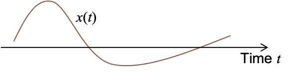</td>
      <td  style="padding: 10px;"><em>DTCA</em> 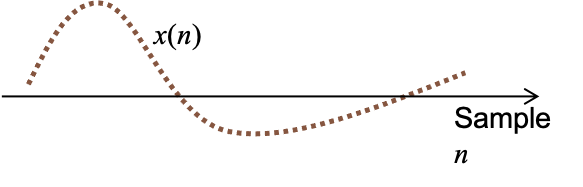</td>
    </tr>
    <tr>
      <th>Discrete-amplitude</th>
      <td><em>CTDA</em> 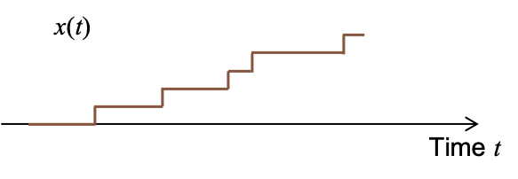</td>
      <td  style="padding: 10px;"><em>Digital</em> </td>
    </tr>
  </tbody>
</table>

Discrete-time signals and especially digital signals are sometimes referred to as **sequences**. For example we say a DNA sequence.

Determine the type of signal in each of the following cases:
* Room temperature (as a function of time):   <button  onclick="showSolution(this,'RmTmp')" style="float:right;">Show Solution</button>  Analog
* Room temperature every hour: <button  onclick="showSolution(this,'RmHour')" style="float:right;">Show Solution</button>  DTCA
* US population as function of time: <button  onclick="showSolution(this,'USpop')" style="float:right;">Show Solution</button>  CTDA
* US population every year: <button  onclick="showSolution(this,'USpop2')" style="float:right;">Show Solution</button>  Digital
* Number of stock transactions every hour: <button  onclick="showSolution(this,'stock')" style="float:right;">Show Solution</button> Digital
* Voice: <button  onclick="showSolution(this,'voice')" style="float:right;">Show Solution</button> Analog

Computers, smart phones, tablets, wearables, etc., all store and process information digitally. But, outside these devices, most of the world is analog. 
* How are digital signals stored on a computer?
* How are analog signals converted to digital signals so that they can be stored and processed on digital devices?

## The binary system

Information on a computer is stored as a stream of binary digits (bits), i.e., in binary. But why binary?
* Simplest piece of an electronic circuit is the switch:
  * Open = off = no current = 0
  * Closed = on = current flows = 1
* Other technologies are similar
  * Magnetic field up / down
  * Light is on / off
  * Something’s there / not there (e.g., the pit in a CD)

So before continuing our discussion about digital and analog signals, we will try to get more familiar with the binary system, specifically how numbers are represented in binary.

### Numbers in binary
We'll start with representing the simplest type of information in binary: numbers. This is done in much the same way as in decimal. But when we represent numbers in decimal we use symbols like $$-$$ and $$.$$ (decimal point). But in the case of binary, we don't have these symbols and they still need to be represented by bits or by some sort of standard.

#### Natural numbers

How do we count in binary? We have digits, in increasing significance from right to left, just as with decimal numbers:
* 000 = 0
* 001 = 1
* 010 = 2
* 011 = 3
* 100	= 4				
* 101 = 5
* 110 = 6
* 111 = 7

The bit in position 𝑖 from the right, counting from 0, has value $$2^𝑖$$. You can verify that this is the case for the above 8 numbers. As another example, the binary number 10010 is equal to 18 decimal:

$$0\times2^0 + 1\times 2^1 + 0\times 2^2+0\times 2^3 + 1\times 2^4=2+16 = 18$$ 

To denote the base, we sometimes put the number in parenthesis and write the base as a subscript. For example, $$(10010)_2=(18)_{10}$$.

To be able to easily organize information in a computer's memory, usually numbers have a prespecified number of bits. A group of 8 bits is called a byte. The largest number that a byte can hold is $$(11111111)_2=255$$.

  Convert 10001010 and 10101010 from binary to decimal. 
  <button  onclick="showSolution(this,'sbin2dec')" style="float:right;">Show Solution</button>

  

    <ol type="i">
      <li>$$(10001010)_2 = 2+8+128$$</li>
      <li>$$(10101010)_2 = 2+8+32+128=170$$</li>
    </ol>
  

 

We can visualize the binary representation via the number wheel, which is shown below for 4 bits. **Adding 1 in binary is equivalent to moving one step clockwise on the wheel.** For example, $$0100+1=0101$$ is equivalent to $$4+1=5$$.

The number wheel highlights the **overflow** problem: If you add one to the largest binary sequences, it goes back to 0. For example, $$1111+1 = 10000$$ but we can't represent the leftmost 1 so it goes back to $$0000$$. This is a type of overflow error. More generally, an overflow happens when the result of some operation cannot be represented by our number system.

#### Integers
So far, we have only talked about how natural numbers are represented in binary. But how can we represent integers? There are different ways to do this including _signed magnitude_, _offset binary_, and _two's complement_. We'll discuss the simplest method, which is signed magnitude. In this method, one bit is dedicated to representing the sign, which can represent negative with 1 and positive with 0. The rest of the bits are used to represent the value. For example, in an 8-bit representation with the leftmost bit as the sign bit, $$10011010 = (-28)_{10}$$.

  Convert 10001010 and 10101010 from 8-bit signed magnitude system to decimal. What is the smallest (negative) number and the largest number that can be represented in this format?
  <button  onclick="showSolution(this,'bin2dec')" style="float:right;">Show Solution</button>

  

    <ol type="i">
      <li>$$(10001010)_2 = -(2+8)=-10$$</li>
      <li>$$(10101010)_2 = -(2+8+32)=-42$$</li>
      <li>The smallest number is \(11111111=-127\) and the largest is \(01111111=127\).</li>
    </ol>
  

 

Below, we show the 4-bit number wheel for signed magnitude representation along with the non-negative representation.
<table align="center">
  <tbody border="none">
    <tr>
      <td style="padding: 20px;">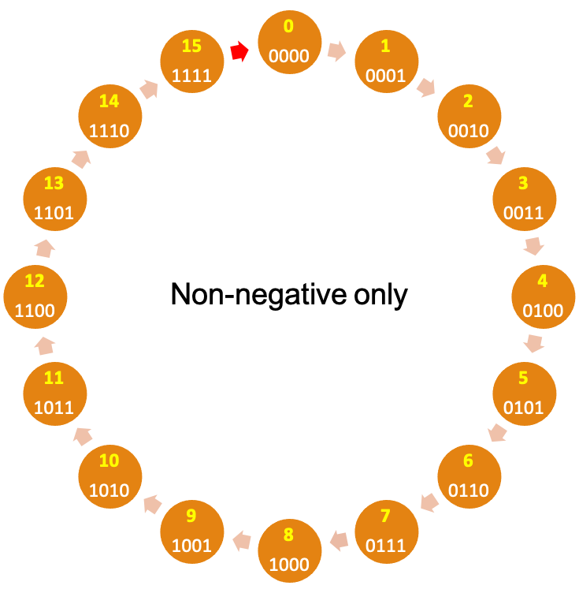</td>
      <td style="padding: 20px;">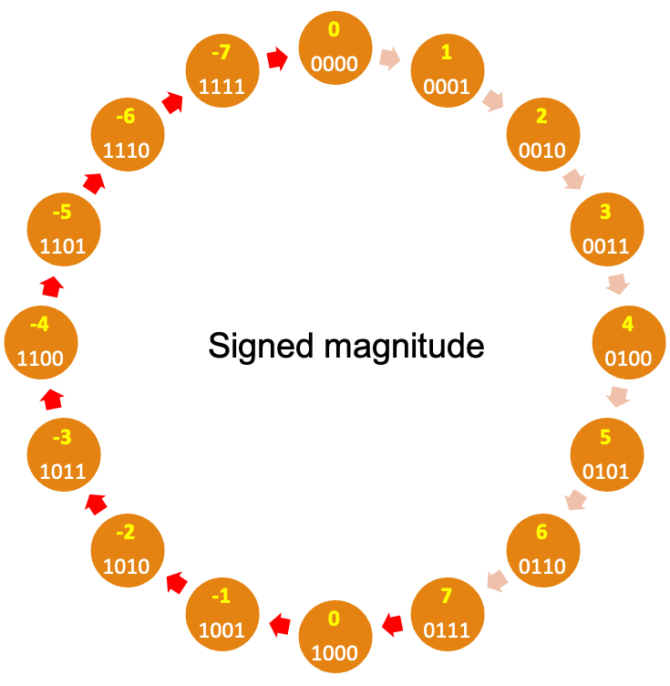</td>
    </tr>
  </tbody>
</table>
These wheels side-by-side highlight a major problem for signed magnitude: **Adding 1 does not always add 1.** On the negative side of wheel $$1100+1=1101$$ which would mean $$(-4)+1=-5$$. This is clearly wrong. So you have to have different algorithms (and logic circuits) for adding positive numbers vs negative numbers. The red arrows represent where adding 1 breaks down (including overflow errors). Signed magnitude has yet another issue, which is having two representation for 0. This is a pain because comparison with 0 is a common operation and will now take longer.

 

There are two other representations that eliminate these shortcomings by arranging the numbers such as adding one (moving clock-wise) is equivalent to increasing the number represented by the binary sequence. 
<table align="center">
  <tbody>
    <tr>
      <td style="padding: 20px;">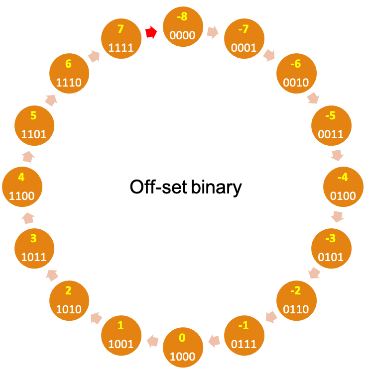</td>
      <td style="padding: 20px;">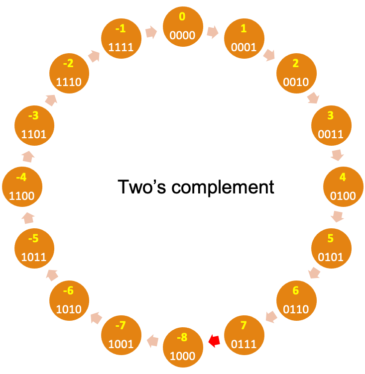</td>
    </tr>
  </tbody>
</table>

In particular, in the **two's complement** system, 0 is represented by 0000 (assuming 4 bits). Moving clockwise, we get the positive numbers and moving counter clockwise (subtracting 1 in each step) we get the negative numbers, with $$-1$$ being represented by 1111, $$-2$$ by 1110 and so on. Of course, there is one step where we go from the largest positive number to the smallest negative number, shown by the red arrow in the image below. Note that the number wheel is divided such that the left-most bit of all negative numbers is 1, making it easy to determine whether a number is negative or not. Non-negative numbers are represented by $0000$ to $0111$ and negative numbers by $1000$ to $1111$. More generally, in the $$n$$-bit two's complement:

\begin{align*}
0 &= (\underbrace{00\dotsm 0}_{n\text{ times}})_2\\
2^{n-1}-1 &= (0\underbrace{11\dotsm 1}_{n-1\text{ times}})_2,\quad \text{(largest positive number)}\\
-2^{n-1} &= (1\underbrace{00\dotsm 0}_{n-1\text{ times}})_2,\quad \text{(smallest number)}\\
-1 &= (\underbrace{11\dotsm 1}_{n\text{ times}})_2.\\
\end{align*}

  <button  onclick="showSolution(this,'2cbin2dec')" style="float:right;">Show Solution</button>
  Consider a 5-bit two's complement system. Find the representation for $0$, $1$, $-1$, $-2$, and $-3$. What number is represented by 11010? What's the largest number? What's the smallest (negative) number?
  

  

    As stated above, in two's complement, 0 is represented by $00000$ and $-1$ by $11111$. Then 1 is obtained by adding 1 to 0 (moving 1 step clockwise), resulting in $00001$. By subtracting 1 from -1, we can obtain $-2=(11110)_2$ and then $-3=(11101)$. These are shown below: 
    \begin{align*}
      0 &= (00000)_2\\
      1 &= (00001)_2\\
      -1 &= (11111)_2\\
      -2 &= (11110)_2\\
      -3 &= (11101)_2\\
    \end{align*}
    A simple way to find what is represented by $11010$ is to count up and see where we reach $-1=(11111)_2$. We have $11010 \to 11011 \to 11100\to 11101 \to 11110 \to 11111$. Counting back, we see that $(11010)_2=-6$. (Based on this reasoning, it is not difficult to find a more efficient and general way to convert negative binary numbers to decimal.)

    
 The largest number is $2^4-1=15$ and the smallest number is $-2^4=-16$.
  

 

<!--#### Rational and real numbers

Rational numbers can be represented using a binary point, which behaves like the decimal point or via a floating point representation. Depending the number of bits used, only a subset of rational numbers can be represented. We'll omit the details again. 

Real number cannot be represented on a computer in an explicit and exact way.-->

## Digital Signals

How do we represent a digital signal on a computer? If our digital signal is a sequence of numbers, we can represent each value as discussed above. But more generally, we can represent digital signals even if the values are not numbers. What we discuss here applies to digital signals whether or not their range is a set of numbers.

To do this, we need a mapping from the range of the signal to binary sequences. For example consider the DNA sequence with the range {A,C,G,T}, for example, AACGTTTCGCTC. We need to find a binary representation for each symbol in the set {A,C,G,T}, for example:

<table align="center" class="tabDefault">
  <thead>
    <tr> <th>Genome symbol</th> <th>Binary representation</th> </tr>
  </thead>
  <tbody>
    <tr> <td>A</td> <td>00</td> </tr>
    <tr> <td>C</td> <td>01</td> </tr>
    <tr> <td>G</td> <td>10</td> </tr>
    <tr> <td>T</td> <td>11</td> </tr>
  </tbody>
</table>
<!--

<svg width="400" height="240">
  <defs>
    <marker id="arrowhead" markerWidth="10" markerHeight="7" 
    refX="0" refY="3.5" orient="auto">
      <polygon points="0 0, 10 3.5, 0 7" />
    </marker>
  </defs>
  <ellipse cx="100" cy="100" rx="50" ry="99" style="fill:rgba(0,256,128,.5);stroke:black;stroke-width:1"/>
  <ellipse cx="300" cy="100" rx="50" ry="99" style="fill:rgba(256,128,0,.3);stroke:black;stroke-width:1"/>
  <text x="35" y="220" font-style="italic">Genome symbols</text>
  <text x="235" y="220" font-style="italic">Binary sequences</text>
  <text x="95" y="40">A</text>
  <text x="95" y="80">C</text>
  <text x="95" y="120">G</text>
  <text x="95" y="160">T</text>
  <text x="295" y="40">00</text>
  <text x="295" y="80">01</text>
  <text x="295" y="120">10</text>
  <text x="295" y="160">11</text>
  <line x1="115" y1="33" x2="270" y2="33" stroke="#000" stroke-width="2" marker-end="url(#arrowhead)" />
  <line x1="115" y1="73" x2="270" y2="73" stroke="#000" stroke-width="2" marker-end="url(#arrowhead)" />
  <line x1="115" y1="113" x2="270" y2="113" stroke="#000" stroke-width="2" marker-end="url(#arrowhead)" />
  <line x1="115" y1="153" x2="270" y2="153" stroke="#000" stroke-width="2" marker-end="url(#arrowhead)" />
</svg>

-->
Then, we can represent each symbol of the DNA sequence with its corresponding binary sequence. This process is called **encoding**. For example, AACGTTTCGCTC can be encoded as 000001101111110110011101. The inverse process of getting the original information back is called **decoding**.

    Decode the binary sequence 0000100101010001 into a DNA sequence, given the table above.    <button  onclick="showSolution(this,'DNAEncode')" style="float:right;">Show Solution</button>
    

    \begin{equation*}
      \underbrace{00}_A\underbrace{00}_A\underbrace{10}_G\underbrace{01}_C\underbrace{01}_C\underbrace{01}_C\underbrace{00}_A\underbrace{01}_C
    \end{equation*}
    

  

 

    Assuming that the Human genome is a DNA sequence with 3 billion symbols, how many bytes (1 byte = 8 bits) is needed to represent it in binary?
       <button  onclick="showSolution(this,'DNASize')" style="float:right;">Show Solution</button>
    

    \begin{equation*}
      \frac{3{,}000{,}000{,}000\times 2}{8}=750{,}000{,}000\ B.
    \end{equation*}
    

  

   	

#### Bit Rate
In the example of encoding a DNA sequence, for each symbol {A,C,G,T}, we used 2 bits. 

 When encoding a sequence into binary, the number of bits used to represent each symbol is called the encoding <strong>bit rate</strong> and its unit is <em>bits/symbol</em>. 

To save storage space, we would like to use the smallest bit rate possible. But what is the smallest possible? For example, some DNA sequences have an extra symbol, N, which represents an unknown nucleotide. Is 2 bits per symbol still enough? No, since there are only 4 binary sequences of length 2, $$\{00,01,10,11\}$$, and this is not enough to represent the 5 symbols {A,C,G,T,N}. We would need at least 3 bits. For example, we could use the following mapping:

<table align="center" class="tabDefault">
  <thead>
    <tr> <th>Genome symbol</th> <th>Binary representation</th> </tr>
  </thead>
  <tbody>
    <tr> <td>A</td> <td>000</td> </tr>
    <tr> <td>C</td> <td>001</td> </tr>
    <tr> <td>G</td> <td>010</td> </tr>
    <tr> <td>T</td> <td>011</td> </tr>
    <tr> <td>N</td> <td>100</td> </tr>
  </tbody>
</table>

Note that the binary sequences 101,110,111 do not represent anything.

Suppose the range of the digital signal contains $$M$$ symbols. There are $$2^N$$ binary sequences of length $$N$$ (by the rule of product). The number of bits $$N$$ must satisfy: 

$$2^N\ge M\iff N\ge \log_2 M.$$

  Suppose a text consists of only uppercase and lowercase English letters and the 6 symbols . , - ? : ! 
  How many bits per symbol is required?
  <button  onclick="showSolution(this,'simpleText')" style="float:right;">Show Solution</button>
  

    Since \(\log_2(26+26+6)=\log_2 58 = 5.86\),  we need at least \(N=6\) bits per symbol.
  

 

 

  Write a question that you still have about this section.

 

<!--## Analog Signals
-->

## Analog Signals

Real-world signals, such as sound, temperature, light intensity and color, are analog signals (ignoring quantum effects). So the range of these signals are uncountable sets. But the data stored in a computing device has a finite nature. So, no matter how much memory I add to my computer or phone, in general, I will not be able to represent an analog signal, such as someone's voice, exactly, and it needs to be approximated.

What that added memory could do is to provide a better approximation of that analog signal. This approximation may be so good that in practice, it’s the same as the original analog signal (e.g., sounds the same to the human ear).

In this section, we will see how analog signals are approximated as digital signals, which can then be stored on a computer.

### From digital to analog: why?
But first, there is a fundamental question that we have ignored so far. It is possible to design analog data storage and transmission systems. In fact, until a couple of decades ago, they were quite common. Here are some examples:
* Cassettes
* Vinyl
* VHS
* Analog phone lines

So why store analog information as 0s and 1s while we can use analog devices? 

The answer is related to what we do with information, which is generally computation and/or communication. And digital is better for both:
* Analog computation is possible but difficult in all but very simple cases
* Removing noise from analog signals is difficult, if not impossible
* Digital information is less dependent on a particular medium. Copying audio from vinyl to cassette tape requires special equipment. Digital data is just bits.

We use numbers for many of the same reasons. I tell people my height in feet and inches, or in centimeters, not by making a marking on a piece of wood.

### From analog to digital: how?

Turning an analog signal (like speech) into a digital one is _called A-to-D conversion_. 

For an analog signal both time and amplitude (values) are continuous. So the A-to-D process is divided into two steps: _sampling_ and _quantization_:
* **Sampling** refers to taking “snapshots” at discrete points in time (or space). Each snapshot is called a sample. The number of samples per unit time is called the _sampling rate_, which depends on the signal. For example, we may record temperature at the rate of once per hour, but for an audio signal we typically take thousands of sample per second. There's a right way of deciding what the sampling rate should be, which we'll discuss later in the course.
* **Quantization** refers to the approximation of the continuous signal value at each sample by a number from a specific discrete set $$Q$$. For example, suppose that light intensity is a real number between 0 and 1. We could choose the discrete set to be $$Q=\{0,\frac1{255},\frac2{255},\dotsc,1\}$$. Each element of $$Q$$ is called a _quantization level_ and itself must be represented by a binary sequence of length $$N$$, where $$N$$ is called the _bit depth_. The size of the set $$Q$$ cannot be larger than $$2^N$$.

The A-to-D conversion through sampling and quantization is shown below. (In the figure, the terms "Analog" and "Digital" only apply to the amplitude.)

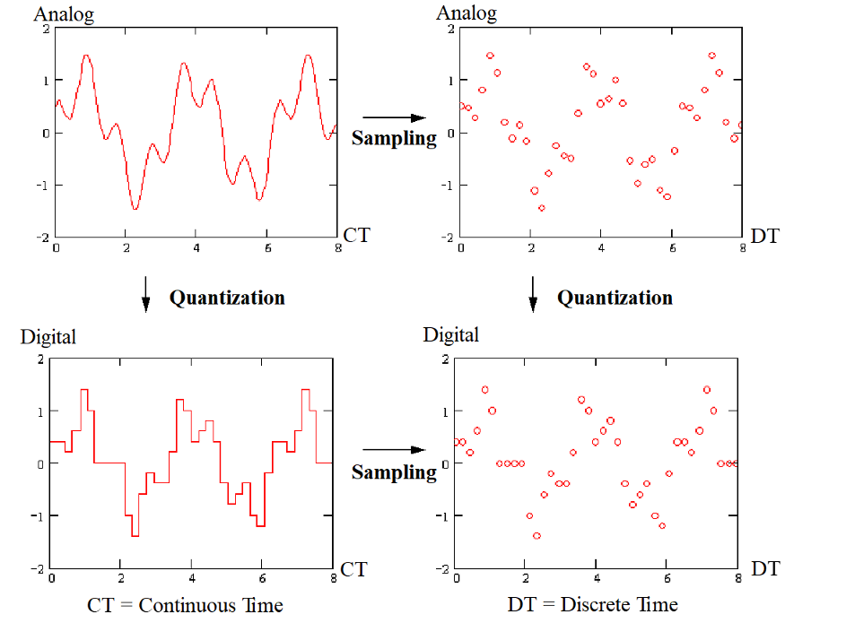

The rest of this section is focused on quantization. Sampling will be discussed later.

### Quantization
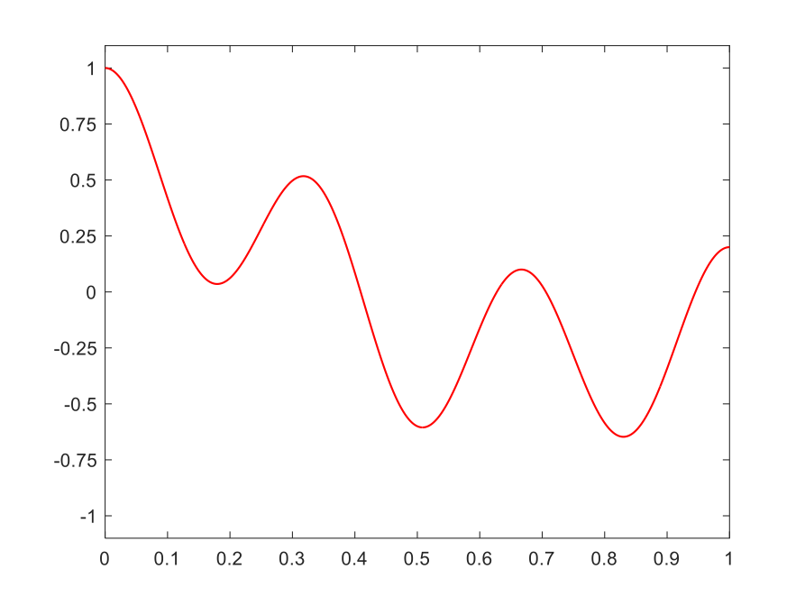
Let's see how quantization works via an example. Consider the signal shown on the right, with range from -1 to 1. Recall that we have to approximate the signal values with values from a finite set of numbers, each of which is in turn represented by a sequence of bits.

For the signal on the right, the simplest quantization is using a single bit. We can represent the positive values by $$.5$$ encoded into binary as 1 and represent the negative values by $$-0.5$$, encoded into binary as 0. This is shown in the <a href="#quantLevelTab"> table</a> below (top-left panel). In this case, the set of quantization levels is $$Q=\{-.5,.5\}$$ and the bit depth is $$N=1$$.

We can increase the number of bits used for each point in time to get more accuracy. With $$N=2$$ bits, we can have $$2^2=4$$ quantization levels and set $$Q=\{-0.75,-0.25,0.25,0.75\}$$. Then, at each moment in time, the value of the signal is mapped to its closest quantization level. The table below also shows quantizations with bit depths 3 and 4.

<table  id="quantLevelTab">
  <tbody>
    <tr>
      <td style="padding-top: 30px"><em>Quantized with bit depth 1</em> 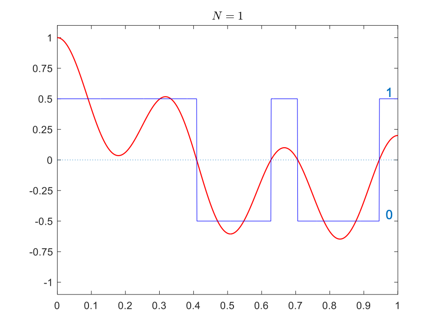</td>
      <td style="padding-top: 30px"><em>Quantized with bit depth 2</em> 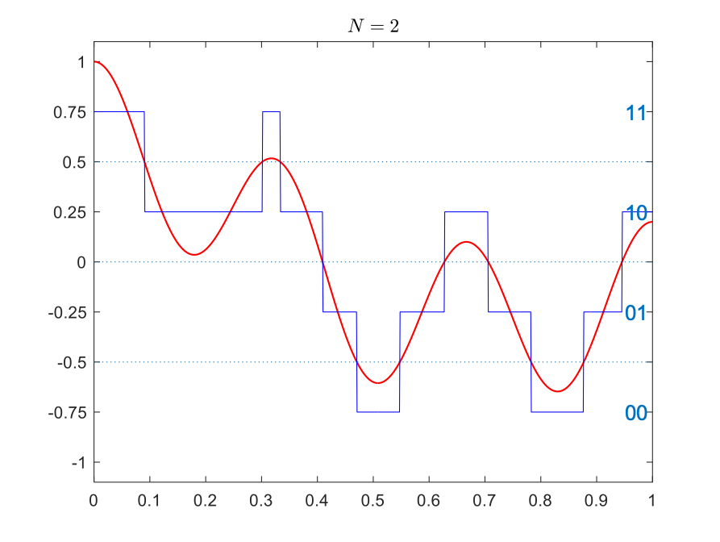</td>
    </tr>
    <tr>
      <td style="padding-top: 30px"><em>Quantized with bit depth 3</em> 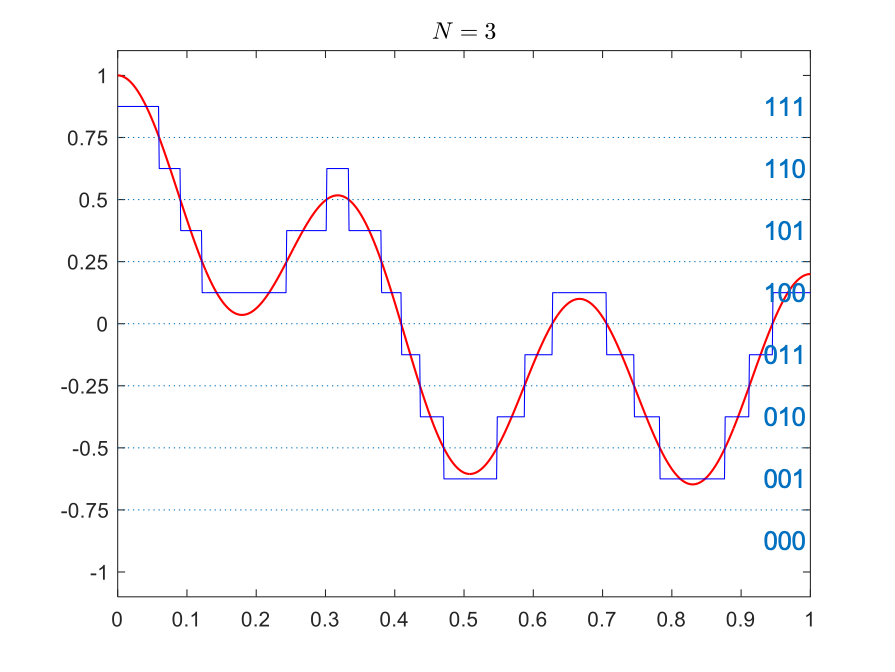</td>
      <td style="padding-top: 30px"><em>Quantized with bit depth 4</em> </td>
    </tr>
  </tbody>
</table>

The quantization error at a given moment is the difference between the true value of the signal and the quantization level it is represented by. 

  By visually inspecting the <a href="#quantLevelTab"> table</a>, for each of the four cases (\(N=1,2,3,4\)), find the quantization level and the binary sequence representing 0.3. What is the error in each case?
  <button  onclick="showSolution(this,'quantLevel')" style="float:right;">Show Solution</button>

<table align="center" class="tabDefault">
  <thead>
    <tr>
      <td>\(N\)</td>
      <td> Quantization level </td>
      <td> Bit sequence </td>
      <td> Error </td>
    </tr>
  </thead>
  <tbody>
    <tr>
      <td>\(1\)</td>
      <td>\(0.5\)</td>
      <td>\(1\)</td>
      <td>\(.3-.5=-.2\)</td>
    </tr>
    <tr>
      <td>\(2\)</td>
      <td>\(0.25\)</td>
      <td>\(10\)</td>
      <td>\(.3-.25=.05\)</td>
    </tr>
    <tr>
      <td>\(3\)</td>
      <td>\(0.375\)</td>
      <td>\(101\)</td>
      <td>\(.3-.375=-.075\)</td>
    </tr>
    <tr>
      <td>\(4\)</td>
      <td>\(0.3125\)</td>
      <td>\(1010\)</td>
      <td>\(.3-.3125=-0.0125\)</td>
    </tr>
  </tbody>
</table>

 

#### Quantization levels and quantization step size

How did we choose the quantization levels in the above example? Given the value of $$N$$, we have $$2^N$$ quantization levels. We thus divide the range into $$2^N$$ intervals. The length of each interval is called the _step size_ and is usually shown by $$\Delta$$. The values in each interval map to the quantization level, which is the middle of the interval. 
For example, for $$N=2$$ above, the range is the interval $$[-1,1]$$, which has length 2. If we divide it into $$4$$ intervals, each interval will have length $$\frac{1-(-1)}{4}=\frac12$$. The intervals will be:

$$(-1,-0.5), (-0.5,0),(0,0.5),(0.5,1).$$

The values in each interval are then represented by the quantization level which is the midpoint:

  \begin{align*}
    (-1,-0.5)&\to -0.75\\
    (-0.5,0)&\to -0.25\\
    (0,0.5)&\to0.25\\
    (0.5,1)&\to 0.75.
  \end{align*}

More generally, if the range of the signal is the interval $$[L,U]$$, then

$$\Delta = \frac{U-L}{2^N}$$

Now any value in the interval $$(L,L+\Delta)$$ is mapped to $$L+\frac\Delta2$$, the interval $$(L+\Delta,L+2\Delta)$$ is mapped to $$L +\frac{3\Delta}2$$, and so on. So the quantization levels are

  \begin{align*}
    Q &= \left\{L+\frac\Delta2,L+\frac{3\Delta}2,L+\frac{5\Delta}2,\dotsc,U-\frac\Delta2\right\}
  \end{align*}

  Determine the quantization step size and the set of quantization levels \(Q\) for \(N=3\) in the <a href="#quantLevelTab"> table</a>. 
  <button  onclick="showSolution(this,'quantLevels')" style="float:right;">Show Solution</button>

  

  \begin{align*}
    \Delta &= \frac{1-(-1)}{2^3}=\frac28=\frac14=0.25\\
    Q &= \left\{-0.875,-0.625,-0.375,-0.125,0.125,0.375,0.625,0.875\right\}
  \end{align*}

 

  For each of the cases in the <a href="#quantLevelTab">table</a> above, what is the maximum quantization error? At which point it time, does this maximum error occur?
  <button  onclick="showSolution(this,'quantError')" style="float:right;">Show Solution</button>

  

    The quantization error is at most half the step size. So the maximum errors for \(N=1,2,3,4\) are \(\frac12,\frac14,\frac18,\frac1{16}\), respectively. The error is equal to these values at time 0, where the signal value is 1.
    

 

**Rounding vs truncation:** In the method discussed above, we put the quantization levels in the middle of each interval and represented values by their closest quantization level. This is called _rounding_. Alternatively, we could put the quantization levels at the lower end of the interval and represent signal values by the closet quantization level that is below or equal to them. This is called _truncation_. For truncation, we still have $$\Delta = \frac{U-L}{2^N}$$, but the levels are 

$$Q=\{L,L+\Delta,L+2\Delta,\dotsc,U-\Delta\}.$$

The figures below compare rounding (left) with truncation (right). The maximum error when using the truncation method is equal to $$\Delta$$ so it is larger than rounding, but it might be sometimes simpler.

<table  class="tabnoborder">
  <tbody>
    <tr>
      <td><em>Rounding</em> 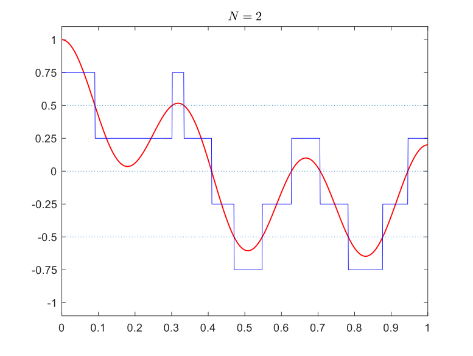</td>
      <td><em>Truncation</em> 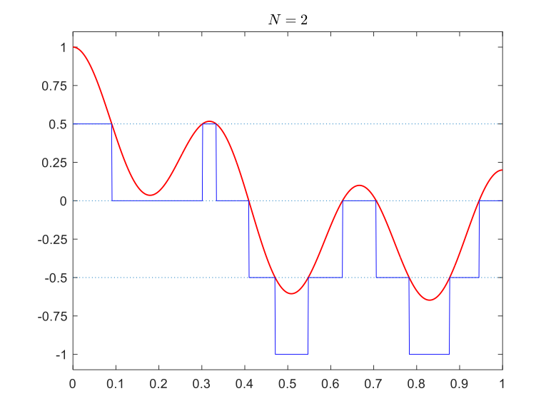</td>
    </tr>
  </tbody>
</table>

 

### Quantizing audio signals
We'll now demonstrate the effect of quantization on audio signals using two examples.

#### A digital tone
First let's see how quantization affects a pure tone. A pure tone is a sinusoid with a given frequency. Below a few periods of the sinusoid $$x(t) = \sin(2\pi 440 t)$$ is shown, which is equivalent to the A note on a piano. Quantized versions of this signal, using different bit depths are also shown. In the plots below, we don't draw the connecting lines between the adjacent points for the quantized (blue) signal, because doing so would make it seem that the signal takes values other than quantization levels. The audio produced by the quantized signals appears below each plot. You can see how low bit depths can lead to poor approximations and as a result poor audio quality.

Note that the original is also digital since you are seeing and playing it on a computer. But the bit depth is larger, so we'll consider it to represent the analog signal.

<table style="text-align: center;">
  <tbody>
    <tr>
      <td  style="padding-top: 80px">
        Original 
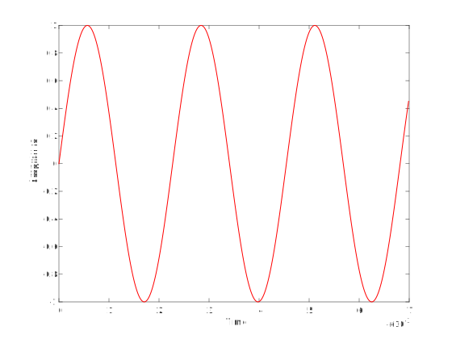
<audio controls>
  <source src="assets/audio/tone.wav" type="audio/wav">
Your browser does not support the audio element.
</audio>
      </td>
      <td  style="padding-top: 80px">
        \(N=2\) 
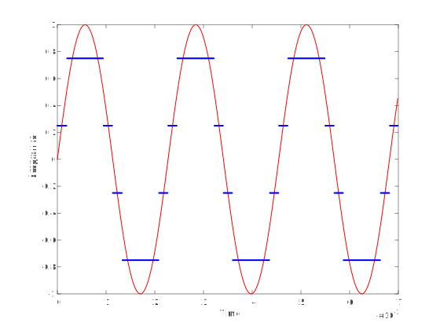
<audio controls>
  <source src="assets/audio/tone2.wav" type="audio/wav">
Your browser does not support the audio element.
</audio>
</td>
    </tr>
    <tr>
      <td  style="padding-top: 80px">
        \(N=4\) 
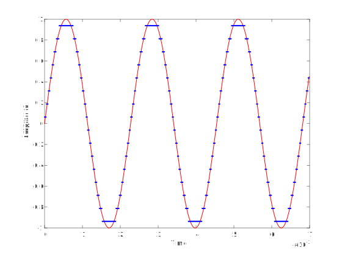
<audio controls>
  <source src="assets/audio/tone4.wav" type="audio/wav">
Your browser does not support the audio element.
</audio>
      </td>
      <td  style="padding-top: 80px">
        \(N=8\) 
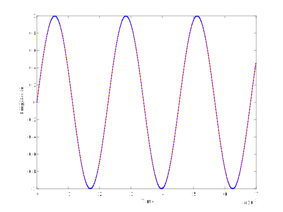
<audio controls>
  <source src="assets/audio/tone8.wav" type="audio/wav">
Your browser does not support the audio element.
</audio>
</td>
    </tr>
  </tbody>
</table>

 

#### Music 
Next we'll see how quantization affects a piece of music. The plots show a small portion of the whole signal.

<table>
  <tbody>
    <tr>
      <td  style="padding-top: 80px; text-align:center">
        Original 
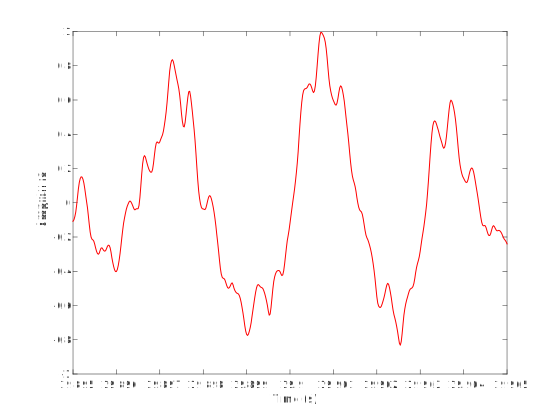
<audio controls>
  <source src="assets/audio/violin.wav" type="audio/wav">
Your browser does not support the audio element.
</audio>
      </td>
      <td  style="padding-top: 80px; text-align:center">
        \(N=2\) 
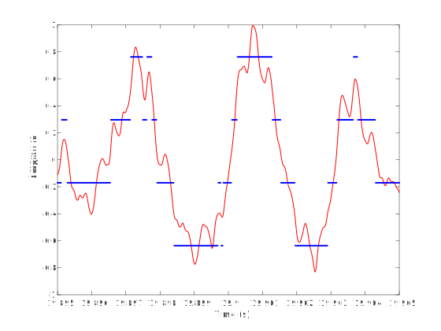
<audio controls>
  <source src="assets/audio/violin2.wav" type="audio/wav">
Your browser does not support the audio element.
</audio>
</td>
    </tr>
    <tr>
      <td  style="padding-top: 80px; text-align:center">
        \(N=4\) 

<audio controls>
  <source src="assets/audio/violin4.wav" type="audio/wav">
Your browser does not support the audio element.
</audio>
      </td>
      <td  style="padding-top: 80px; text-align:center">
        \(N=8\) 
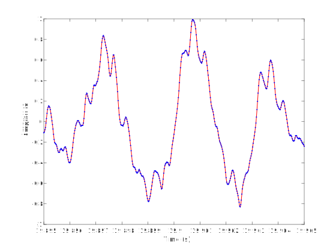
<audio controls>
  <source src="assets/audio/violin8.wav" type="audio/wav">
Your browser does not support the audio element.
</audio>
</td>
    </tr>
  </tbody>
</table>
<a href="https://freesound.org/people/tranquility.jadgroup/sounds/372005/" target="_blank">Source of audio file: freesound.org/people/tranquility.jadgroup</a> 
Note: if you have an exciting piece of music that you own the rights to, you can share it with me to use for this example.

#### What’s happening?

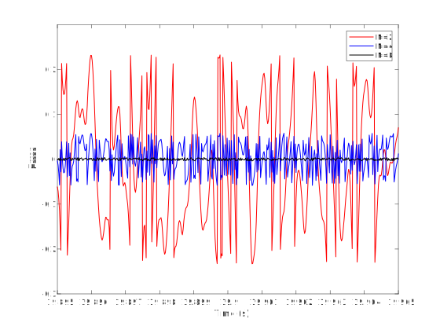

Quantization error/noise occurs because we are approximating the signal. The noise for the music above is shown in the figure on the right. For both rounding and truncating, the maximum error is not larger than the step size $$\Delta=\frac{\text{Range}}{2^N}$$. Although this is always true, for a given signal, a quantity better describing the degradation is the power of noise:

  \begin{align*}
  𝑥(𝑡)&: \text{original signal from 0 to }T\\
  𝑦(𝑡)&: \text{quantized signal}\\
  𝑛(𝑡)=𝑦(𝑡)−𝑥(𝑡)&: \text{quantization noise}\\
  𝑃_𝑛=\frac1T ∫_0^𝑇(𝑛(𝑡))^2 𝑑𝑡 &: \text{noise power}
  \end{align*}

The noise power tends to decrease as the square of the maximum error, so it becomes less noticeable as $$N$$ increases.
For simplicity, we focus on maximum error $$\Delta$$ rather than $$𝑃_𝑛$$.

 

### Quantization in images

Now lets look at some examples to see how quantization affects images. The figure on the right is our "original" image, which is itself quantized to 8 bits (256 quantization levels). When displayed, each quantization level corresponds to a color. So in the figure on the right, there are 256 different shades of gray. 

You can see below the effect of quantizing to lower bit depths. The figure on the left has only 8 gray shades. The one on the right, only has two shades of gray. Note that we have freedom to choose our quantization levels. For example, for $$N=1$$, we could choose one quantization level as black and the other as white, rather than two shades of gray.
<table class="tabnoborder"><tbody>
<tr><td></td><td>
</td></tr></tbody></table>

 

### Clipping errors

Recall a digital signal on a computer has a finite (not just discrete) range. Clipping error occurs when the analog signal exceeds the range covered by the quantization levels. This is also called saturation, or the signal is said to be clipped at the "rails".

Clipping errors can happen, for example, if we design our quantizer for a speech signal at conversational loudness, but then someone starts loudly singing! Or when we don't set the shutter speed properly and the amount of light entering the camera exceeds the amount that the sensor can accurately quantize. It can also happen by design as we'll see <a href="#trading-clipping-for-quantization-error">to reduce quantization error</a>.

An example of clipping is shown below.

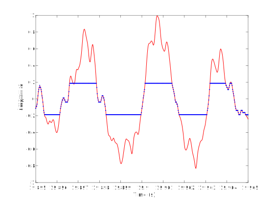

<audio controls>
  <source src="assets/audio/violin4clpd2.wav" type="audio/wav">
Your browser does not support the audio element.
</audio>

 
 

Clipping errors can also happen when capturing images using a camera because of overexposure, underexposure, or low dynamic range:
* Overexposure happens when too much light is allowed to enter the camera so areas that are brighter than a certain threshold become white and lose all the detail. 
* Underexposure is the opposite problem, with not enough light.
* The dynamic range of the camera determines its capability in capturing both bright and dark areas. If the scene has both really bright and really dark areas one or both will lose their detail.

An example of clipping is given. The figure on the right is brightened to simulate overexposure, with the result shown below. Some parts of the image become completely white since their brightness is larger than the maximum quantization level. These areas are shown using red in the figure below right.
<table class="tabnoborder"><tbody>
<tr><td></td><td>
</td></tr></tbody></table>

### Trading clipping for quantization error

Clipping can sometimes be prevented by setting the range of the quantizer to the maximum input range. But the quantization error is Range / $$2^N$$. So, increased range gives increased quantization error. Depending on the application, we need to decide how much of the signal range is going to be covered by the quantizer's range. We may decide to allow some clipping to reduce the quantization error, given a fixed bit depth.
 
Another idea: use non-uniform quantization steps to make the quantization error / signal strength a constant. For example, for audio signals a small noise when the signal is low can be heard clearly while if the signal is high, we might not hear the noise. This is also related to floating-point numbers, but we won't discuss it now.

### How much memory?

In the digitization process, we need to take samples and the value of the signal at each sample is quantized to a quantization level. Each level is then represented by a sequence of $$N$$ bits. So how much memory do we need to store a given signal?

For example, for audio:
(number of bits) = (bit depth) × (# of samples/second) × (# length of recording) x (# of channels = 2 for stereo)

For CD’s: bit depth = 16, and sample rate = 44100 samples/second.
Why 44100 samples? More on this later!

  How much storage space is needed for 80 minutes of music?

 

  Write a question that you have about Analog signals and quantization.

 

